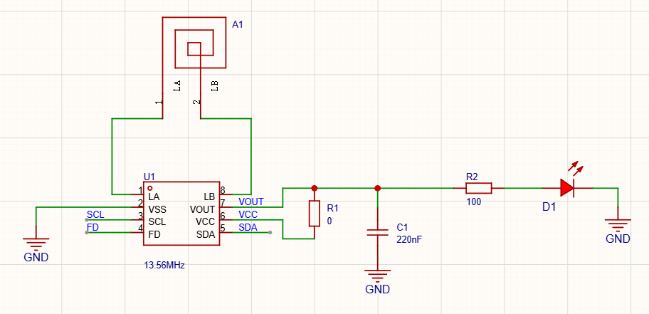
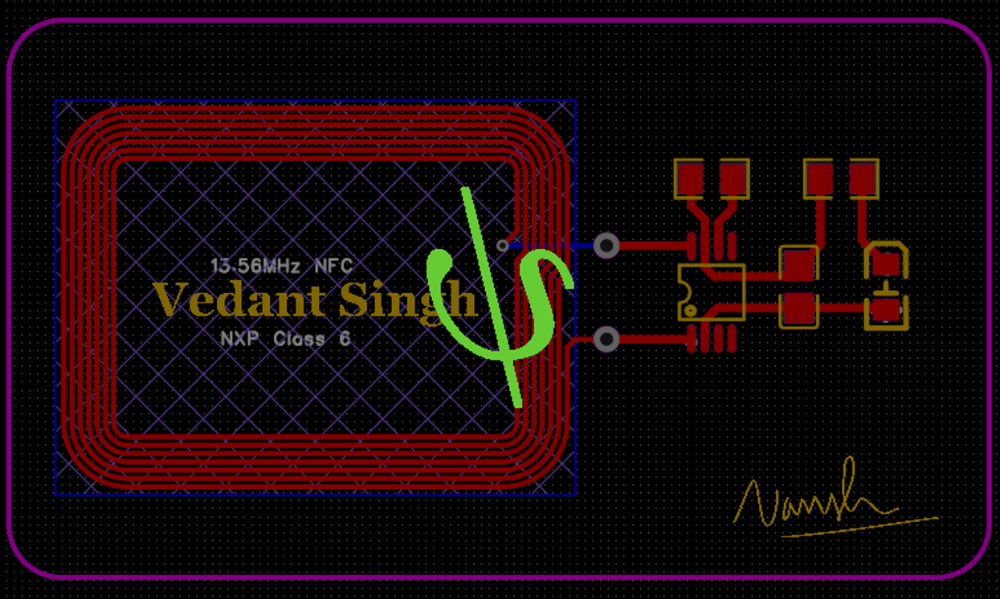
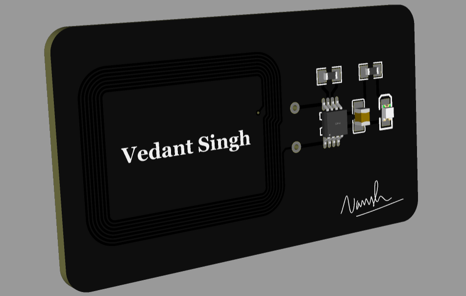

# pcb-nfc-card
A minimalist, matte black PCB NFC card with an integrated NFC antenna loop. I built this to replace traditional paper cards with a sleek piece of hardware that instantly shares a digital portfolio or contact info when tapped against a phone.

- Schematic:

- Raw PCB:

- 3D PCB:

## What is this?
This project is an open-source, hardware-level **PCB NFC card** designed around a custom 13.56MHz copper antenna loop. Instead of a standard plastic sticker enclosure, the circuit board serves as both the structural body and the high-frequency wireless receiver. It features a high-contrast matte black solder mask paired with exposed silver-plated component pads for a raw, industrial hardware aesthetic.

## What is its function?
The card operates as a passive **Near Field Communication (NFC) transponder**. When brought within proximity of an active NFC reader (such as a smartphone or dedicated scanner), the integrated copper coil harvests electromagnetic energy over the air to power the onboard IC. Once energized, the chip modulates the field to wirelessly transmit its stored data payload—enabling data transfers, automated logic triggering, or wireless access authentication without requiring an onboard battery.

## Fabrication specs
If you want to order a batch of these for yourself, here is the exact recipe to use on a fab house like JLCPCB to get the same total-black and silver aesthetic;

- Layer: 2 Layers (Do not change this to 1, or the antenna jump loop will break)
- Base Material: FR4 (1.6mm thickness)
- Solder Mask: Black (You can choose your preferred color)
- Silkscreen: White (Default)
- Finish: Lead-free HASL (This coats the exposed component pads in bright, skin-safe silver chrome)
- Via Covering: Via Plugged (Fills the antenna vias with black mask material to keep the surface relatively smooth)

## Repo Structure
- [pcb_parts_bom.csv](pcb_parts_bom.csv): Parts used in the PCB (Just for information)
- [Gerber_PCB1_2026-09-01.zip](Gerber_PCB1_2026-09-01.zip): Gerber zip for PCB manufacturers (like JLCPCB)
- [PCB_NFC_Card.epro2](PCB_NFC_Card.epro2): Basically the schematic and pcb
- [Screenshot-2026-09-01-042927.png](Screenshot-2026-09-01-042927.png): Screenshot of raw PCB
- [Screenshot-2026-09-01-041146.png](Screenshot-2026-09-01-041146.png): Screenshot of 3D view of PCB
- [Screenshot-2026-09-01-044723.png](Screenshot-2026-09-01-044723.png): Screenshot of the PCB schematic
- [bom.csv](bom.csv): The actual bill of material for the user!

## How to edit the source files and get your NFC PCB Card?
1. First, download or clone this repository
2. Open the web interface or desktop client for EasyEDA Pro
3. Go to File > Open > EasyEDA Pro Project.
4. Select and import the .epro2 file from this repository to load the schematics and layout.
5. Hurray, edit your name and printables you want on your silk layer (top and bottom), and export YOUR gerber.zip to JLCPCB to get a print!
6. Once you get your card shipped to you. It can be written with a writing tool available on iOS/Android to make it fully functional.
7. You may also password-protect it to avoid overwriting. (Optional)

## PCB components' BOM for nerds:

[pcb parts bom](pcb_parts_bom.csv)

## BOM for user:

[bom for you!](bom.csv)

## LICENSE and Use:
[MIT](LICENSE) - Use, Modify, and Share as you like, at your own risk.

## Notes:
- I hope ya'll love the card.
- Will update on how to use once I get my card shipped!
- The card in the repo has less info due to privacy, but you may add whatever you like while editing the source PCB.
- While getting it printed, try to get enough cards and as a panel, because it is cheaper than buying 5 cards. (info about JLCPCB)
- If ya'll like this project, you can visit my [profile](https://github.com/vd-sh) for more latest projects and repositories.
